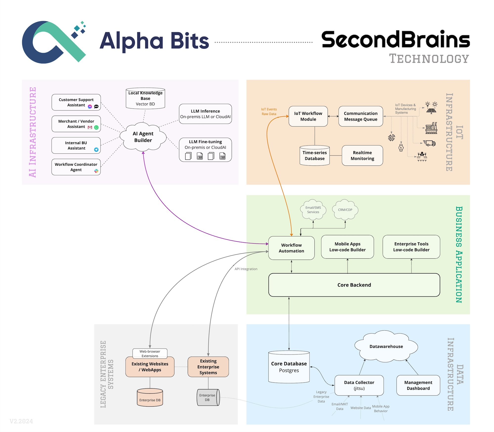

# SecondBrains Architecture by Alpha Bits

SecondBrains is a architecture framework, designed by Alpha Bits team, to allow enterprises to setup workflow automations and various AI Agents for internal and external purposes.

Updated: Feb 2024.
