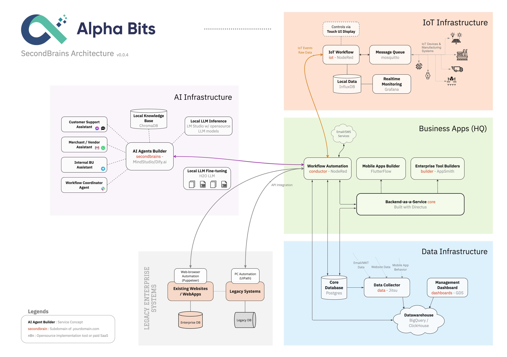

*Updated: v0.0.4 ~ March 2024. [Link to PDF](assets/pdfs/latest.pdf).*

# SecondBrains Architecture by Alpha Bits

SecondBrains is an open-source framework designed to empower SMEs and Startups with advanced workflow automation, data analytics, and AI agent building capabilities, using a selection of low-code or no-code tools. This framework developed with a focus on businesses without in-house technical teams, hence these tools have been chosen to minimize the need for a large team of developers, suitable for small project's budget. SecondBrains aims to democratize access to cutting-edge technologies. The framework and its components have been tested in production environments for several clients of ours, ensuring reliability and effectiveness in real-world applications.

# The Conductor

Centrally to the SecondBrains framework, the Conductor is the essentially coordinator/automator/data-steward/controller of data from one system to another.
We strongly recommend Node-Red as the open-source solution to this. Node-Red has been around for over 10 years, and is a great tool for building complex workflows; paired with a high performance MQTT broker, it is a powerful combination. There is definitly a learning curve, but once you get over the initial change of mindset to flow-based programming, everything else will be much easier, thanks to the wide community support, available of community plugins spaning over decades.

Each Conductor can work alone and interact with other Conductors via private link (ZeroTier/VPN) and orchestrate the workflow across different business units.

# Target Audience

The SecondBrains framework is specifically designed for Tech Leads, CIOs, and CTOs with a technical background. It offers a set of tools and capabilities meant to enhance and streamline the technological landscape of your organisation. With its focus on workflow automation, data analytics, and AI agent building, SecondBrains provides a foundation for tech leaders seeking to implement advanced tech solutions without the need for extensive in-house resources.

# Features

**Workflow Automation:** Automating business and IoT workflows, streamlining operations without the need for complex coding.

**Data Analytics:** Leverage local and cloud data storage solutions along with analytics and visualization tools to gain insights from your data.

**AI Agent Builder:** Build and deploy AI agents using open-source frameworks and libraries, enabling advanced customer support, internal business operations, and vendor management through AI.

**Integration Ecosystem:** Seamlessly integrate with existing systems and applications, including IoT devices, enterprise databases, and business applications, enhancing your tech stack's capabilities without disrupting existing operations.

# Detailed Technical Components

| Module                  | Service                  | Implementation Tool | Link to Website                               | Role of Component                                                              |
| ----------------------- | ------------------------ | ------------------- | --------------------------------------------- | ------------------------------------------------------------------------------ |
| **Core Systems**        | Legacy Data Management   | Directus            | [directus.io](https://directus.io/)           | No-code back-end-as-a-service or also known as Headless CMS                    |
|                         | Core Database            | Postgres            | [postgresql.org](https://www.postgresql.org/) | Postgres to work with Directus, SQL is preferred for data analytics purposes   |
| **Enterprise Apps**     | Mobile Apps Builder      | FlutterFlow         | [flutterflow.io](https://flutterflow.io/)     | Enables rapid mobile app development                                           |
|                         | Enterprise Tool Builders | AppSmith            | [appsmith.com](https://www.appsmith.com/)     | Low-code platform for building internal tools                                  |
| **Data Analytics**      | Data Collector           | Jitsu               | [jitsu.com](https://jitsu.com/)               | Collects data from various sources                                             |
|                         | Real-time Monitoring     | Grafana             | [grafana.com](https://grafana.com/)           | Visualizes data from multiple sources in real-time                             |
|                         | Datawarehouse            | BigQuery            | [cloud.google.com](https://cloud.google.com/bigquery)| Stores and analyzes large volumes of data                               |
| **AI Agent Builder**    | AI Agent Builder         | Dify.ai             | [dify.ai](https://dify.ai/)                   | Provides tools for building and deploying AI agents                            |
|                         | Local Knowledge Base     | ChromaDB            | [trychroma.com](https://www.trychroma.com/)   | Stores local knowledge for AI inference                                        |
|                         | AI Training              | H2O LLM Studio      | [h2o.ai](https://h2o.ai/)                     | Facilitates local LLM fine-tuning and training of AI models                    |
|                         | AI Inference             | LM Studio           | [lmstudio.ai](https://lmstudio.ai/)           | local LLM inference using open-source LLM models                               |
| **IoT Infrastructure**  | Message Queue            | Mosquitto           | [mosquitto.org](https://mosquitto.org/)       | Facilitates message queuing for IoT communications                             |
|                         | IoT Workflow Coordinator | NodeRed             | [nodered.org](https://nodered.org/)           | Enables low-code programming for event-driven IoT applications                 |

# Support
If you need help or have questions about SecondBrains, please check out our Discussions section for common questions or to open a new topic. For direct support, Alpha Bits is currently offering consultation and implementation services tailored to the diverse open-source stack utilized in the SecondBrains architecture ([contact@alphabits.team](mailto:contact@alphabits.team)).

# Implementation

Implementing the tools within the SecondBrains framework is straightforward, primarily utilizing Docker or npm for setup. This approach facilitates easy and efficient deployment across various environments. We are currently in the process of refining our Docker configuration files to further simplify the deployment process. These improved templates will be made available in our upcoming version release. We welcome contributions from the community! If you have insights, improvements, or feedback on our Docker configurations or any other aspect of SecondBrains, your participation would greatly help us enhance the framework for everyone's benefit.

# TODO

- Docker compose files.
- Setup instructions.
- Setup Production ENV.

# License
SecondBrains is released under the MIT License. Feel free to use, modify, and distribute it as per the license agreement.
